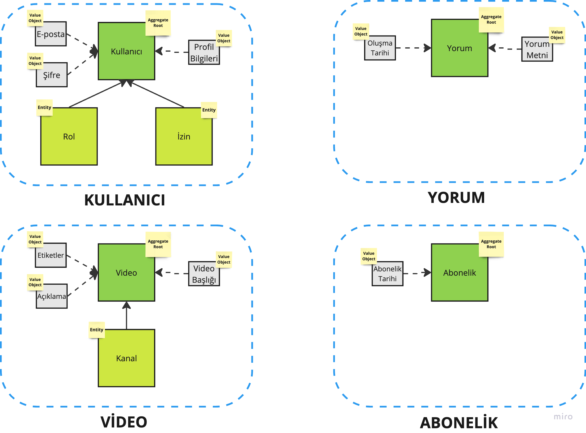

### Projeler nasıl build edilir ?

Tek Seferde : 

```bash
cd comment-service && ./mvnw clean package verify && cd - &&
cd subscription-service && ./mvnw clean package verify && cd - && 
cd user-service && ./mvnw clean package verify && cd - &&
cd video-service && ./mvnw clean package verify && cd -         
```

Ayrı ayrı : 
Örnek comment-service 

```bash
cd comment-service 
./mvnw clean package verify
```


### Servisler birlikte nasil çalıştırılır ?
Herhangi bir port numarası seçilebilir.
Aşağıdaki her satır ayrı bir terminal ekranında çalıştırılır.
```bash
cd comment-service && ./mvnw spring-boot:run -Dspring-boot.run.arguments=--server.port=9090 && cd - 
cd subscription-service && ./mvnw spring-boot:run -Dspring-boot.run.arguments=--server.port=9091 && cd - 
cd user-service && ./mvnw spring-boot:run -Dspring-boot.run.arguments=--server.port=9092 && cd - 
cd video-service && ./mvnw spring-boot:run -Dspring-boot.run.arguments=--server.port=9093 && cd -         
```
### Servis ve Bağlam Sınırları



