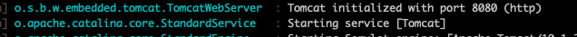

### Uygulama nasıl çalıştırılır

```bash
./mvnw spring-boot:run
```

### Uygulama nasıl build edilir?

```bash
./mvnw clean package verify
```

### Uygulamanın veritabanına nasıl bakılır ?
Veritabanı in-memory H2'dir. 

Resimdeki loglarda bu log kaydında uygulama port tespit edilir(8080 örneğin) 
http://localhost:uygulama-portu/h2-console adresine browserdan girilir. 

jdbc url alanına 
resimdekine benzer olan url yazılır 

### Uygulama nasıl test edilir ?
Resimdeki loglarda bu log kaydında uygulama port tespit edilir(8080 örneğin)  

http://localhost:uygulama-portu/swagger-ui/index.html adresine browserdan girilir. 
İlgili endpointe istek yapilir.(Try it out) 